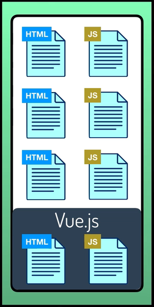
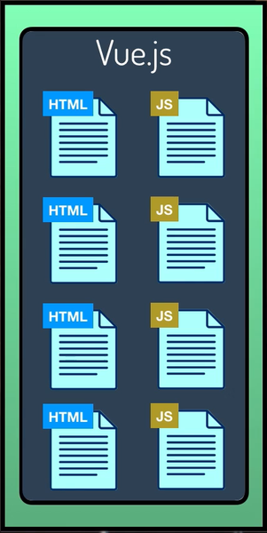
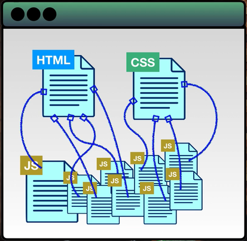
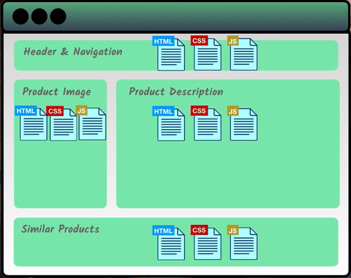

# Information about **Vue JS**

## 1. **What** is Vue?
>Vue is a progressive framework of JS for buliding user interfaces.

là 1 framework linh động dùng để xây dựng user interface

điểm linh động: có thể tích hợp vào 1 phần nhỏ của hệ thống hoặc toàn bộ hệ thống.
 
 
 
 (nhắc đến các framework lớn khác của JS thì còn có React (by FB) và Angular (by GG))
## 2.  **Why** we need Vue?

Nếu như chỉ dùng những công cụ hiện tại tạo trang web thì cấu trúc của nó như này
 

 
=> phức tạp và khó bảo trì
 
Nhưng khi sử dụng Vue thì như thế này 
 

 
=> có những ưu điểm như có thể tái sử dụng những phần có thể dùng lại được.

Vue đáp ứng dễ dàng nhu cầu xây dựng ứng dụng đơn trang (*Single Page Application*). 

(chẳng hạn như là lúc mình click vào 1 cái button thì webpage sẽ ko tải lại cả trang mà chỉ load thêm những nội dung liên quan đến event click đó)

=> nhờ đó *giảm tải* cho sever, tăng hiệu suất

## 3. **Who** created Vue? 

Vue is created by **Evan You** after after his working at Google (là 1 nhân viên cũ của google)

## 4. **When** was Vue created?

the first version of Vue was released **in 2014 **
 hiện tại đã có phiên bản thứ 3

